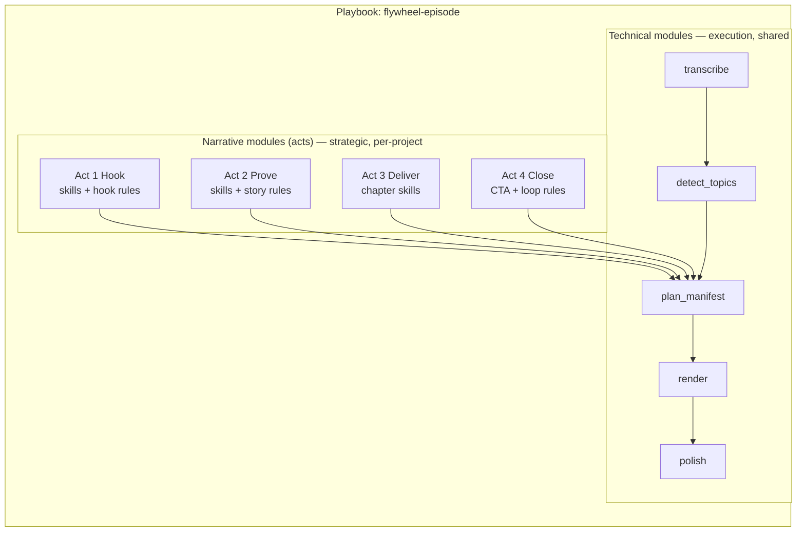

# Flywheel Acts — Technical vs Narrative Modules

If the **flywheel-episode** shape is the playbook archetype, it has **two module layers**:

| Layer | Question it answers | Implemented as |
|-------|---------------------|----------------|
| **Technical modules** | *How* is the video processed? | Python scripts (`transcribe`, `render`, …) |
| **Narrative modules** | *Why* does this clip exist — what move does it make on the viewer? | **Acts** + skills + manifest tags |

**Technical modules are shared across projects.**  
**Narrative modules (acts) are designed per project** — same flywheel shape, different hooks, CTAs, and cut style.

See also: [`playbooks.md`](playbooks.md) · [`vision.md`](vision.md) (6 flywheel stages)

---

## The 4 acts (macro flywheel)

The full flywheel has **6 granular stages** ([`vision.md`](vision.md)). For **design and playbooks**, group them into **4 acts** — each act is one **narrative module** you configure per project:

```
┌──────────┐   ┌──────────┐   ┌──────────┐   ┌──────────┐
│  ACT 1   │ → │  ACT 2   │ → │  ACT 3   │ → │  ACT 4   │
│  HOOK    │   │  PROVE   │   │ DELIVER  │   │  CLOSE   │
└──────────┘   └──────────┘   └──────────┘   └──────────┘
 attract         trust          service         referral
 engage                         (+ chapter)      loop
```

| Act | Narrative job | Flywheel stages | Viewer after |
|-----|---------------|-----------------|--------------|
| **1 — Hook** | Stop scroll, name the pain, invite reaction | `attract`, `engage` | "This is about me" / "I want to respond" |
| **2 — Prove** | Story, transparency, credibility before the deep dive | `trust` | "This person is real" |
| **3 — Deliver** | Full value — the long chapter IS this act | `service` | "That helped me" |
| **4 — Close** | Proof, results, tease what's next | `referral`, `loop` | "Others win too" / "I need the next piece" |

**Publish order (typical):** Act 1 shorts → Act 2 short → **Act 3 chapter** → Act 4 shorts.

Act 3 is usually **one 10–30 min contiguous cut**. Acts 1, 2, 4 are usually **shorts** (contiguous or supercut depending on project).

---

## 6 stages vs 4 acts

| 4 acts (design units) | 6 stages (manifest tags) |
|-----------------------|--------------------------|
| Hook | attract, engage |
| Prove | trust |
| Deliver | service |
| Close | referral, loop |

Stages are **tags on clips** in `manifest.json`. Acts are **containers in the playbook** that say which skills + technical defaults apply when planning that beat.

---

## Visual: two layers in one playbook



- **Technical pipeline** runs once on the source video (transcribe → topics → manifest → render).
- **Narrative modules** run during **plan_manifest** — agent plans each act using different skills and cut defaults.

---

## What each layer controls

| Concern | Technical module | Narrative module (act) |
|---------|------------------|-------------------------|
| Whisper / ffmpeg | ✓ | |
| Silence trim level | ✓ (render) | act suggests default |
| cut_mode contiguous vs supercut | ✓ (render) | act chooses |
| Hook type / opening line | | ✓ skill |
| CTA wording | | ✓ skill |
| Which transcript moments | | ✓ agent + topics |
| flywheel_stage tag | | ✓ act → stage |
| Platform (YT vs TikTok) | | ✓ act override |

**Example:** Act 1 (Hook) on Project A uses TikTok aggressive trim + 15s contiguous shorts. Same act on Project B uses Reels 45s + supercut hooks — **same narrative job**, different technical profile.

---

## Config shape: acts in a playbook

```json
{
  "playbook_id": "flywheel-episode",
  "acts": [
    {
      "act_id": "hook",
      "stages": ["attract", "engage"],
      "output": "shorts",
      "skills": ["skills/youtube_shorts", "skills/tiktok_shorts"],
      "cut_mode": "contiguous",
      "default_trim": "aggressive",
      "planning": "Pick 1–2 hook windows per chapter; bold pain or question"
    },
    {
      "act_id": "prove",
      "stages": ["trust"],
      "output": "shorts",
      "skills": ["skills/instagram_reels"],
      "cut_mode": "contiguous",
      "default_trim": "moderate",
      "planning": "Story or transparency moment; never hard sell"
    },
    {
      "act_id": "deliver",
      "stages": ["service"],
      "output": "chapters",
      "skills": ["skills/youtube_chunks"],
      "cut_mode": "contiguous",
      "default_trim": "light",
      "planning": "Full topic arc 600–1800s; self-contained"
    },
    {
      "act_id": "close",
      "stages": ["referral", "loop"],
      "output": "shorts",
      "skills": ["skills/youtube_shorts"],
      "cut_mode": "contiguous",
      "default_trim": "moderate",
      "planning": "Result/proof + tease next chapter or episode"
    }
  ]
}
```

Projects override acts in `pipeline.json`:

```json
{
  "project_id": "thp-onboarding-ep4",
  "playbook_id": "flywheel-episode",
  "overrides": {
    "acts": {
      "hook": { "default_trim": "aggressive", "cut_mode": "supercut" }
    }
  }
}
```

---

## Hikmat: flywheel off, acts replaced

Hikmat uses playbook `timelapse-montage` — **no flywheel acts**. Narrative is a single custom beat:

| Act equivalent | Hikmat |
|----------------|--------|
| Hook | Result-first visual hook (not attract/engage) |
| Deliver | N/A (no long chapter) |
| Close | Result outro on montage |

Same **technical modules** (`concat`, `compose_shorts`, `render`); completely different **narrative design** in project skills.

---

## Design new flywheel projects

1. Start from playbook `flywheel-episode`
2. For each **act**, decide: platforms, cut_mode, trim, hook strategy (project skills)
3. Run technical modules once
4. Agent plans manifest **act by act** — each clip gets `flywheel_stage` + act-appropriate trim/cut
5. Render — technical module applies per-clip settings from manifest

**Fork the playbook when the act structure changes** (e.g. 3-act webinar, 5-act course). Fork **project overrides** when only strategy changes within the same 4 acts.

---

## Glossary

| Term | Meaning |
|------|---------|
| **Technical module** | Executable pipeline step (script) |
| **Narrative module** | **Act** — strategic beat with skills + planning intent |
| **Stage** | Fine-grained flywheel tag on a clip (`attract` … `loop`) |
| **Playbook** | Full recipe: technical module_order + acts + defaults |
| **Project** | Playbook + overrides + this video's requirements |
