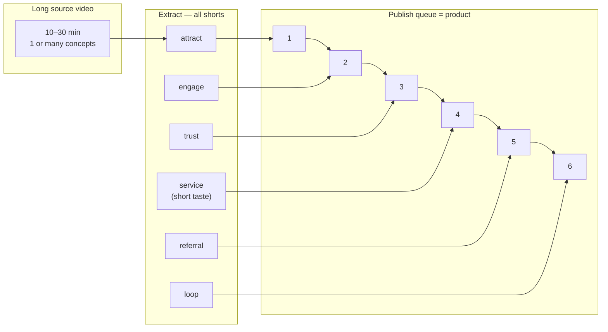
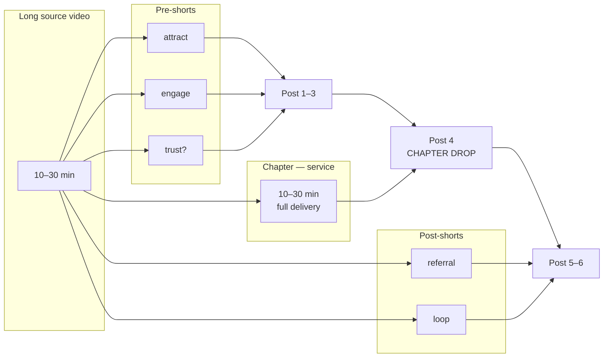
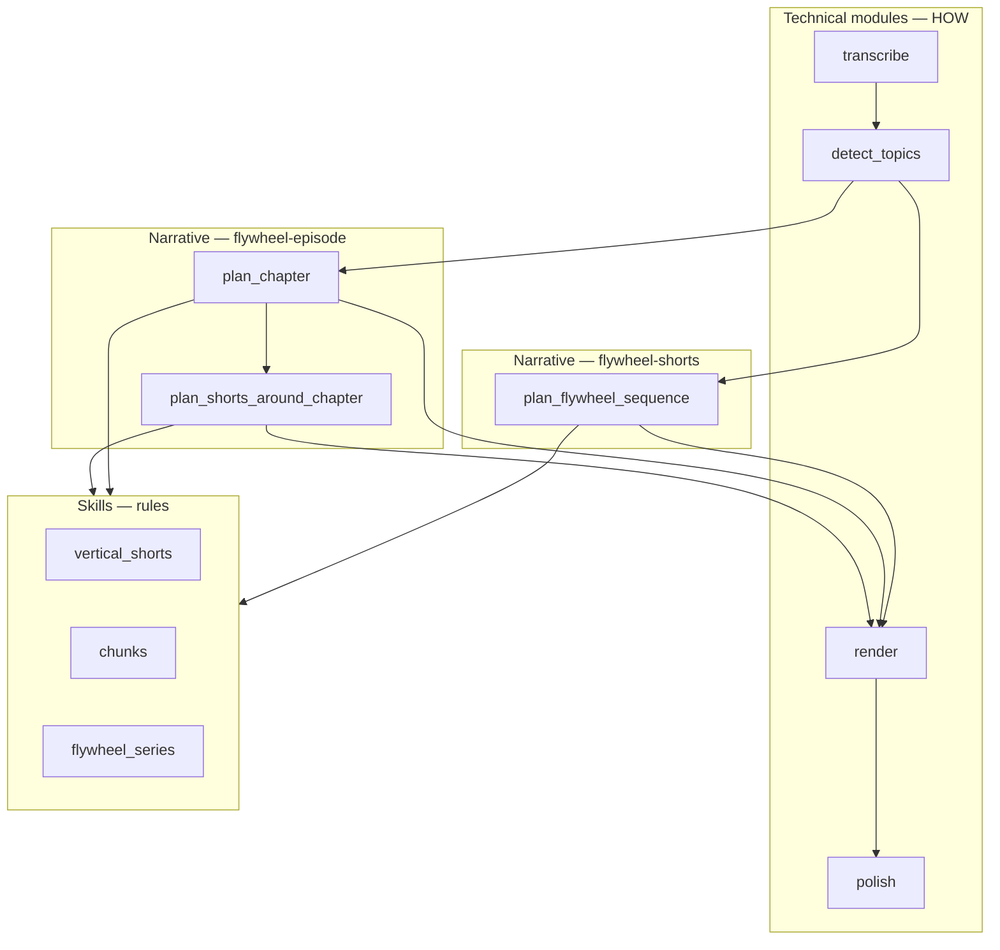

# Flywheel Strategies — Visual

Companion to [`flywheel-strategies.md`](flywheel-strategies.md)

---

## Two strategies, one flywheel vocabulary

Both use stages: `attract` → `engage` → `trust` → `service` → `referral` → `loop`  
They differ in **what delivers service** and **what the viewer concludes with**.

---

## Strategy A: flywheel-shorts



**Conclusion:** Viewer finished the sequence — trust earned through the journey.  
Long video optional afterward.

---

## Strategy B: flywheel-episode



**Conclusion:** Viewer watched shorts → got full chapter payoff → post-shorts loop to next.  
Chapter is the center of gravity.

---

## Module layers (both strategies)



---

## ASCII: pick a strategy

```
                    ┌─────────────────────┐
                    │   Long source video  │
                    └──────────┬──────────┘
                               │
              ┌────────────────┴────────────────┐
              ▼                                 ▼
   ┌──────────────────────┐        ┌──────────────────────┐
   │  FLYWHEEL-SHORTS     │        │  FLYWHEEL-EPISODE    │
   │  Product: short queue│        │  Product: chapter +  │
   │                      │        │  wrapper shorts      │
   │  s→s→s→s→s→s         │        │  s→s→CHAPTER→s→s     │
   └──────────────────────┘        └──────────────────────┘
```

---

## Project assignment

```
content_pipeline/projects/{name}/pipeline.json

  "playbook_id": "flywheel-shorts"   OR   "flywheel-episode"
```

Same source → two playbooks → two manifests → two conclusions.
