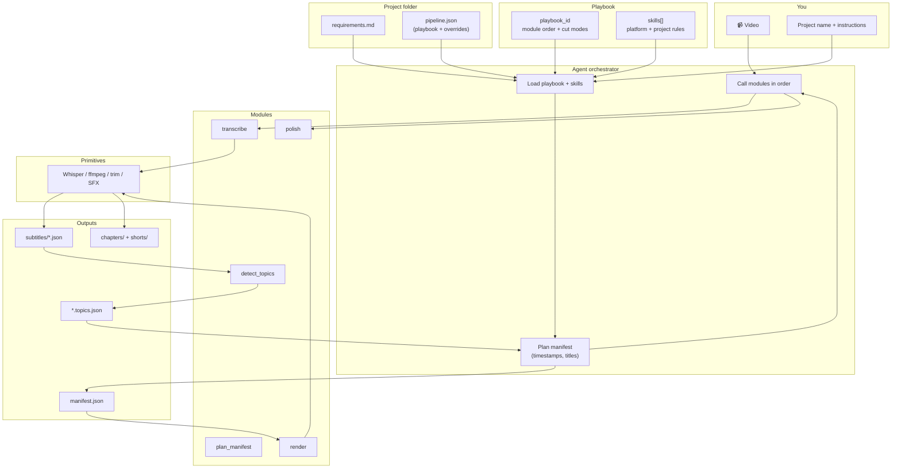

# Playbooks — Visual Architecture & Design Guide

**Goal:** Multiple reusable **playbooks**. Each playbook defines which **modules** to run, which **skills** apply, and in what order — so every project/video type gets a designed production recipe.

Related: [`modular-pipeline.md`](modular-pipeline.md) · [`flywheel-strategies.md`](flywheel-strategies.md) · [`flywheel-strategies-visual.md`](flywheel-strategies-visual.md) · [`playbooks/README.md`](playbooks/README.md)

---

## Vocabulary

| Term | What it is |
|------|------------|
| **Primitive** | One mechanical operation inside Python/ffmpeg (Whisper, one cut, trim) |
| **Module** | One callable script — a packaged step (`transcribe`, `render`, …) |
| **Skill** | Rules for *how to plan* — duration, hooks, flywheel (not execution) |
| **Playbook** | **Modules + skills + order + defaults** for a production outcome |
| **Act** (narrative module) | One flywheel **beat** — strategic rules for hook/prove/deliver/close |
| **Stage** | Fine tag on a clip: `attract` … `loop` (6 total, grouped into 4 acts) |
| **Project** | A playbook instance + job-specific docs (`requirements.md`, assets) |
| **Manifest** | The edit plan (seconds, titles) between planning and render |

```
Primitives  →  Modules  →  Playbook (+ Skills)  →  Project  →  Outputs
 (ffmpeg)      (scripts)    (recipe)              (this job)   (mp4s)
```

---

## When you give me a video



---

## Vertical stack

```
┌──────────────────────────────────────────────────────────────┐
│  YOU: video file + "use flywheel-episode playbook"           │
└────────────────────────────┬─────────────────────────────────┘
                             ▼
┌──────────────────────────────────────────────────────────────┐
│  PLAYBOOK  (reusable recipe — planning/playbooks/*.json)     │
│  • which modules, in what order                              │
│  • cut_mode defaults (contiguous vs supercut)                │
│  • which skills to read                                      │
│  • flywheel on/off, trim profiles                            │
└────────────────────────────┬─────────────────────────────────┘
                             ▼
┌──────────────────────────────────────────────────────────────┐
│  PROJECT  (one job — content_pipeline/projects/{name}/)      │
│  • pipeline.json  → playbook_id + overrides                  │
│  • requirements.md → audience, assets, this video's goal     │
│  • skills/        → project skill overrides (optional)       │
└────────────────────────────┬─────────────────────────────────┘
                             ▼
┌──────────────────────────────────────────────────────────────┐
│  AGENT  (orchestrator)                                       │
│  • Apply skills while planning                               │
│  • run_module.py / direct scripts                            │
│  • Write manifest.json → human review → render               │
└────────────────────────────┬─────────────────────────────────┘
                             ▼
┌──────────────────────────────────────────────────────────────┐
│  MODULES  →  PRIMITIVES  →  OUTPUTS                          │
└──────────────────────────────────────────────────────────────┘
```

---

## Designing a new playbook

1. **Name the outcome** — e.g. "flywheel episode", "timelapse montage", "podcast single chapter"
2. **Pick modules** — enable/disable in `modules{}`
3. **Set order** — `module_order[]`
4. **Attach skills** — `skills[]` paths the agent must read when planning
5. **Set cut defaults** — `chapters.cut_mode`, `shorts.cut_mode`, trim levels
6. **Save** — `planning/playbooks/{playbook-id}.json`
7. **Assign to project** — `projects/{name}/pipeline.json` → `"playbook_id": "..."`

### Playbook file shape

```json
{
  "playbook_id": "flywheel-episode",
  "name": "THP flywheel episode",
  "description": "Long speech → chapters + flywheel shorts",
  "module_order": ["transcribe", "detect_topics", "plan_manifest", "render", "polish"],
  "skills": [
    "skills/youtube_chunks",
    "skills/youtube_shorts",
    "skills/flywheel_series"
  ],
  "modules": { "...": "..." },
  "chapters": { "cut_mode": "contiguous", "default_trim": "light" },
  "shorts": { "cut_mode": "contiguous", "default_trim": "moderate" },
  "flywheel": { "enabled": true, "tag_shorts": true }
}
```

### Assign to a project

```json
{
  "project_id": "thp-episode-04",
  "playbook_id": "flywheel-episode",
  "overrides": {
    "shorts": { "default_trim": "aggressive" }
  }
}
```

Or copy the full playbook into `projects/{name}/pipeline.json` and customize inline (hikmat does this today).

---

## Playbook catalog

| Playbook ID | Strategy | Primary output |
|-------------|----------|----------------|
| [`flywheel-shorts`](playbooks/flywheel-shorts.json) | Shorts queue = flywheel journey | ordered `shorts[]` |
| [`flywheel-episode`](playbooks/flywheel-episode.json) | Chapter + wrapper shorts | `chapters[]` + `shorts[]` |
| [`timelapse-montage`](playbooks/timelapse-montage.json) | Visual timelapse (no speech) | supercut shorts |
| [`podcast-chapter`](playbooks/podcast-chapter.json) | Single deep-dive | one chapter |

Add new playbooks to [`playbooks/`](playbooks/) — don't fork module code.

---

## Two playbooks side by side

```
FLYWHEEL-EPISODE                    TIMELAPSE-MONTAGE
─────────────────                   ─────────────────
Video (speech)                      Many clips → concat
    │                                   │
    ▼                                   ▼
[transcribe]                          [concat]
    │                                   │
    ▼                                   ▼
[detect_topics]                       [compose_shorts]
    │                                   │
    ▼                                   ▼
[plan_manifest] ◄── skills:           [plan_manifest] ◄── skills:
  youtube_chunks                        hikmat/montage_compose
  flywheel_series                       youtube_shorts (project)
  youtube_shorts                        │
    │                                   │
    ▼                                   ▼
[render] trim: light/moderate         [render] trim: off
    │                                   │
    ▼                                   ▼
[polish] optional                     (no polish)
    │                                   │
    ▼                                   ▼
chapters/ 16:9                        shorts/ 9:16 supercut
shorts/  9:16 flywheel-tagged
```

---

## Invoke

```bash
# List playbooks
ls planning/playbooks/*.json

# Run one module for a project (playbook gates enabled modules)
python3 content_pipeline/run_module.py --project origin-story --module render -- \
  --manifest "projects/0. the origin story/output/plan/manifest.json"

# Agent loads playbook via project
# projects/0. the origin story/pipeline.json → playbook_id: flywheel-shorts
```

---

## Where files live

| What | Path |
|------|------|
| **This doc** (visuals + design) | `planning/playbooks.md` |
| **Playbook templates** | `planning/playbooks/*.json` |
| **Project assignment** | `content_pipeline/projects/{name}/pipeline.json` |
| **Module catalog** | `content_pipeline/modules/README.md` |
| **Platform skills** | `skills/` |
| **Project skill overrides** | `content_pipeline/projects/{name}/skills/` |

---

## Design principles

1. **One playbook = one production outcome** — not one playbook per video file
2. **Modules stay dumb** — scripts execute; playbooks and skills decide *when* and *how*
3. **Fork playbooks, not code** — new marketing sequence = new JSON playbook
4. **Agent is orchestrator** — reads playbook, applies skills, calls modules, writes manifest
5. **Human gate** — manifest review before render until a series is trusted
